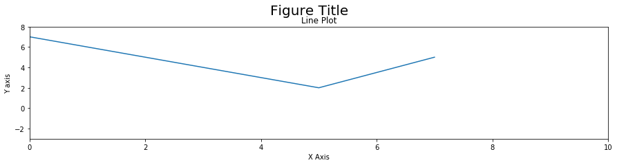
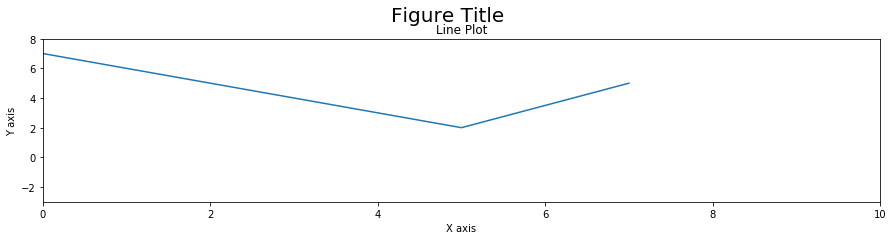
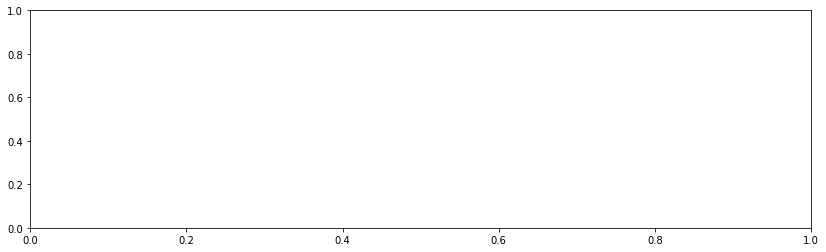
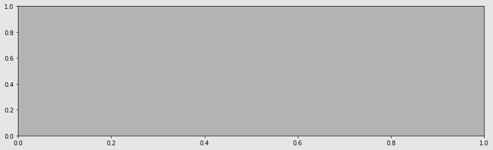
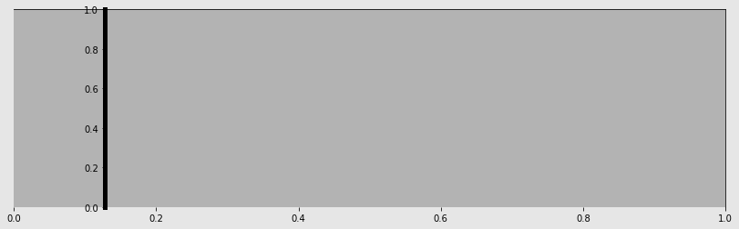
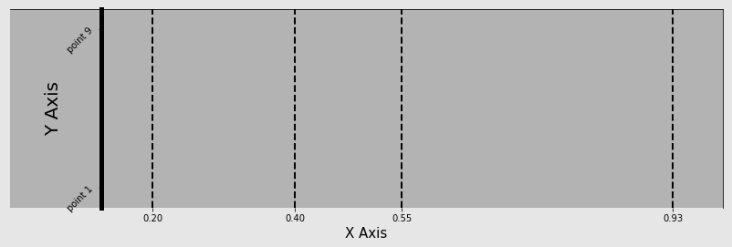
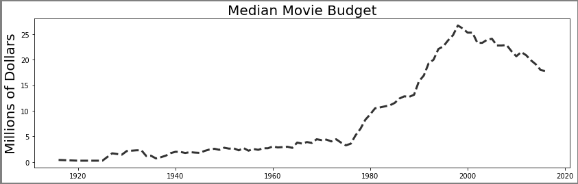
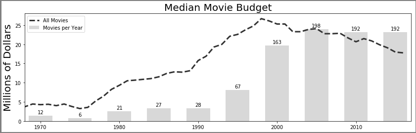
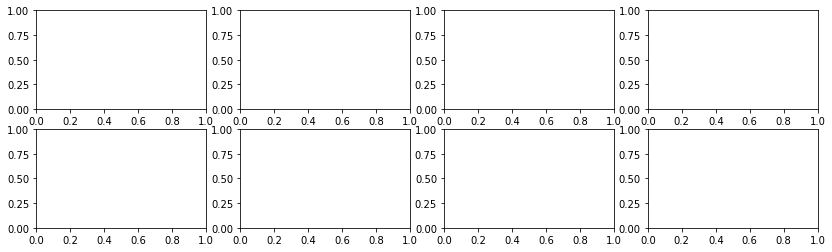

```python
import pandas as pd
import numpy as np
import matplotlib.pyplot as plt

%matplotlib inline
```


```python
x = [-3, 5, 7]
y = [10, 2, 5]

plt.figure(figsize=(15,3))
plt.plot(x, y)
plt.xlim(0, 10)
plt.ylim(-3, 8)
plt.xlabel('X Axis')
plt.ylabel('Y axis')
plt.title('Line Plot')
plt.suptitle('Figure Title', size=20, y=1.03)
```


    Text(0.5, 1.03, 'Figure Title')





```python
fig, ax = plt.subplots(figsize=(15,3))
ax.plot(x, y)
ax.set_xlim(0, 10)
ax.set_ylim(-3, 8)
ax.set_xlabel('X axis')
ax.set_ylabel('Y axis')
ax.set_title('Line Plot')
fig.suptitle('Figure Title', size=20, y=1.03)
```


    Text(0.5, 1.03, 'Figure Title')





```python
fig, ax = plt.subplots(nrows=1, ncols=1)
```


```python
type(fig)
```


    matplotlib.figure.Figure


```python
type(ax)
```


    matplotlib.axes._subplots.AxesSubplot


```python
fig.get_size_inches()
```


    array([6., 4.])


```python
fig.set_size_inches(14, 4)
fig
```





```python
fig.axes
```


    [<matplotlib.axes._subplots.AxesSubplot at 0x7f6119a6bcc0>]


```python
fig.axes[0] is ax
```


    True


```python
fig.set_facecolor('.9')
ax.set_facecolor('.7')
fig
```





```python
spines = ax.spines
spines
```


    OrderedDict([('left', <matplotlib.spines.Spine at 0x7f6119a6b6a0>),
                 ('right', <matplotlib.spines.Spine at 0x7f6119a6b518>),
                 ('bottom', <matplotlib.spines.Spine at 0x7f6119a6b208>),
                 ('top', <matplotlib.spines.Spine at 0x7f6119a6b198>)])


```python
spine_left = spines['left']
spine_left.set_position(('outward', -100))
spine_left.set_linewidth(5)

spine_bottom = spines['bottom']
spine_bottom.set_visible(False)
fig
```





```python
ax.xaxis.grid(True, which='major', linewidth=2, color='black', linestyle='--')
ax.xaxis.set_ticks([.2, .4, .55, .93])
ax.xaxis.set_label_text('X Axis', family='Verdana', fontsize=15)

ax.set_ylabel('Y Axis', family='Calibri', fontsize=20)
ax.set_yticks([.1, .9])
ax.set_yticklabels(['point 1', 'point 9'], rotation=45)
fig
```

    /usr/local/lib/python3.6/dist-packages/matplotlib/font_manager.py:1241: UserWarning: findfont: Font family ['Verdana'] not found. Falling back to DejaVu Sans.
      (prop.get_family(), self.defaultFamily[fontext]))
    /usr/local/lib/python3.6/dist-packages/matplotlib/font_manager.py:1241: UserWarning: findfont: Font family ['Calibri'] not found. Falling back to DejaVu Sans.
      (prop.get_family(), self.defaultFamily[fontext]))





```python
ax.xaxis.properties()
```


    {'agg_filter': None,
     'alpha': None,
     'animated': False,
     'children': [Text(0.5, 22.200000000000003, 'X Axis'),
      Text(1, 23.200000000000003, ''),
      <matplotlib.axis.XTick at 0x7f6119ad4f28>,
      <matplotlib.axis.XTick at 0x7f6119a5feb8>,
      <matplotlib.axis.XTick at 0x7f6119a8f8d0>,
      <matplotlib.axis.XTick at 0x7f6119a8fb00>],
     'clip_box': <matplotlib.transforms.TransformedBbox at 0x7f6119a80630>,
     'clip_on': True,
     'clip_path': None,
     'contains': None,
     'data_interval': array([ inf, -inf]),
     'figure': <Figure size 1008x288 with 1 Axes>,
     'gid': None,
     'gridlines': <a list of 4 Line2D gridline objects>,
     'in_layout': True,
     'label': Text(0.5, 22.200000000000003, 'X Axis'),
     'label_position': 'bottom',
     'label_text': 'X Axis',
     'major_formatter': <matplotlib.ticker.ScalarFormatter at 0x7f6119a5fac8>,
     'major_locator': <matplotlib.ticker.FixedLocator at 0x7f6119a4c0f0>,
     'major_ticks': [<matplotlib.axis.XTick at 0x7f6119ad4f28>,
      <matplotlib.axis.XTick at 0x7f6119a5feb8>,
      <matplotlib.axis.XTick at 0x7f6119a8f8d0>,
      <matplotlib.axis.XTick at 0x7f6119a8fb00>],
     'majorticklabels': <a list of 4 Text major ticklabel objects>,
     'majorticklines': <a list of 8 Line2D ticklines objects>,
     'majorticklocs': array([0.2 , 0.4 , 0.55, 0.93]),
     'minor_formatter': <matplotlib.ticker.NullFormatter at 0x7f6119a5fa58>,
     'minor_locator': <matplotlib.ticker.NullLocator at 0x7f6119a6b668>,
     'minor_ticks': [],
     'minorticklabels': <a list of 0 Text minor ticklabel objects>,
     'minorticklines': <a list of 0 Line2D ticklines objects>,
     'minorticklocs': [],
     'minpos': inf,
     'offset_text': Text(1, 23.200000000000003, ''),
     'path_effects': [],
     'picker': None,
     'pickradius': 15,
     'rasterized': None,
     'scale': 'linear',
     'sketch_params': None,
     'smart_bounds': False,
     'snap': None,
     'tick_padding': 3.5,
     'tick_space': 26,
     'ticklabels': <a list of 4 Text major ticklabel objects>,
     'ticklines': <a list of 8 Line2D ticklines objects>,
     'ticklocs': array([0.2 , 0.4 , 0.55, 0.93]),
     'ticks_direction': array(['out', 'out', 'out', 'out'], dtype='<U3'),
     'ticks_position': 'bottom',
     'transform': <matplotlib.transforms.IdentityTransform at 0x7f6119a55be0>,
     'transformed_clip_path_and_affine': (None, None),
     'units': None,
     'url': None,
     'view_interval': array([0., 1.]),
     'visible': True,
     'zorder': 1.5}


```python
movie = pd.read_csv('data/movie.csv')

med_budget = movie.groupby('title_year')['budget'].median() / 1e6
med_budget_roll = med_budget.rolling(5, min_periods=1).mean()
med_budget_roll.tail()
```


    title_year
    2012.0    20.893
    2013.0    19.893
    2014.0    19.100
    2015.0    17.980
    2016.0    17.780
    Name: budget, dtype: float64


```python
years = med_budget_roll.index.values
years[-5:]
```


    array([2012., 2013., 2014., 2015., 2016.])


```python
budget = med_budget_roll.values
budget[-5:]
```


    array([20.893, 19.893, 19.1  , 17.98 , 17.78 ])


```python
fig, ax = plt.subplots(figsize=(14,4), linewidth=5, edgecolor='.5')
ax.plot(years, budget, linestyle='--', linewidth=3, color='.2', label='All Movies')
text_kwargs=dict(fontsize=20, family='cursive')
ax.set_title('Median Movie Budget', **text_kwargs)
ax.set_ylabel('Millions of Dollars', **text_kwargs)
```


    Text(0, 0.5, 'Millions of Dollars')


    /usr/local/lib/python3.6/dist-packages/matplotlib/font_manager.py:1241: UserWarning: findfont: Font family ['cursive'] not found. Falling back to DejaVu Sans.
      (prop.get_family(), self.defaultFamily[fontext]))





```python
movie_count = movie.groupby('title_year')['budget'].count()
movie_count.tail()
```


    title_year
    2012.0    191
    2013.0    208
    2014.0    221
    2015.0    192
    2016.0     86
    Name: budget, dtype: int64


```python
ct = movie_count.values
ct_norm = ct / ct.max() * budget.max()

fifth_year = (years % 5 == 0) & (years >= 1970)
years_5 = years[fifth_year]
ct_5 = ct[fifth_year]
ct_norm_5 = ct_norm[fifth_year]

ax.bar(years_5, ct_norm_5, 3, facecolor='.5', alpha=.3, label='Movies per Year')
ax.set_xlim(1968, 2017)
for x, y, v in zip(years_5, ct_norm_5, ct_5):
    ax.text(x, y + .5, str(v), ha='center')
ax.legend()
fig
```





```python
plot_objects = plt.subplots()
```


```python
type(plot_objects)
```


    tuple


```python
fig = plot_objects[0]
ax = plot_objects[1]
```


```python
plot_objects = plt.subplots(2, 4, figsize=(14, 4))
```





```python
plot_objects[1]
```


    array([[<matplotlib.axes._subplots.AxesSubplot object at 0x7f6119781e10>,
            <matplotlib.axes._subplots.AxesSubplot object at 0x7f61197302e8>,
            <matplotlib.axes._subplots.AxesSubplot object at 0x7f6119755668>,
            <matplotlib.axes._subplots.AxesSubplot object at 0x7f61196fcbe0>],
           [<matplotlib.axes._subplots.AxesSubplot object at 0x7f61196ae198>,
            <matplotlib.axes._subplots.AxesSubplot object at 0x7f61196d56d8>,
            <matplotlib.axes._subplots.AxesSubplot object at 0x7f611967dc50>,
            <matplotlib.axes._subplots.AxesSubplot object at 0x7f611962f1d0>]],
          dtype=object)


```python
fig.get_axes() == fig.axes
```


    True


```python
fig, ax = plt.subplots()
```


```python
fig.axes == fig.get_axes()
```


    True


```python
ax.xaxis == ax.get_xaxis()
```


    True


```python
ax.yaxis == ax.get_yaxis()
```


    True


```python

```
