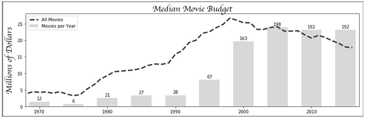
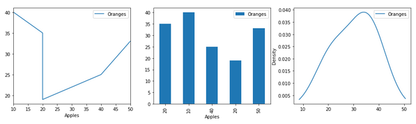

# Chapter 11 - Pandas Foundation pada buku Pandas Cookbook
#### download data yang akan digunakan pada [Pandas-Cookbook](https://github.com/PacktPublishing/Pandas-Cookbook)
#### data yang saya dowload saya letakkan pada "/data"

# Pembahasan Praktik :
## Chapter 11
#### Getting started with matplotlib
```python
import pandas as pd
import numpy as np
import matplotlib.pyplot as plt

get_ipython().run_line_magic('matplotlib', 'inline')

x = [-3, 5, 7]
y = [10, 2, 5]

plt.figure(figsize=(15,3))
plt.plot(x, y)
plt.xlim(0, 10)
plt.ylim(-3, 8)
plt.xlabel('X Axis')
plt.ylabel('Y axis')
plt.title('Line Plot')
plt.suptitle('Figure Title', size=20, y=1.03)

fig, ax = plt.subplots(figsize=(15,3))
ax.plot(x, y)
ax.set_xlim(0, 10)
ax.set_ylim(-3, 8)
ax.set_xlabel('X axis')
ax.set_ylabel('Y axis')
ax.set_title('Line Plot')
fig.suptitle('Figure Title', size=20, y=1.03)
fig, ax = plt.subplots(nrows=1, ncols=1)
type(fig)
type(ax)
fig.get_size_inches()
fig.set_size_inches(14, 4)
fig
fig.axes
fig.axes[0] is ax
fig.set_facecolor('.9')
ax.set_facecolor('.7')
fig
spines = ax.spines
spines
spine_left = spines['left']
spine_left.set_position(('outward', -100))
spine_left.set_linewidth(5)
spine_bottom = spines['bottom']
spine_bottom.set_visible(False)
fig
ax.xaxis.grid(True, which='major', linewidth=2, color='black', linestyle='--')
ax.xaxis.set_ticks([.2, .4, .55, .93])
ax.xaxis.set_label_text('X Axis', family='Verdana', fontsize=15)

ax.set_ylabel('Y Axis', family='Calibri', fontsize=20)
ax.set_yticks([.1, .9])
ax.set_yticklabels(['point 1', 'point 9'], rotation=45)
fig
ax.xaxis.properties()

movie = pd.read_csv('data/movie.csv')

med_budget = movie.groupby('title_year')['budget'].median() / 1e6
med_budget_roll = med_budget.rolling(5, min_periods=1).mean()
med_budget_roll.tail()
years = med_budget_roll.index.values
years[-5:]

budget = med_budget_roll.values
budget[-5:]
fig, ax = plt.subplots(figsize=(14,4), linewidth=5, edgecolor='.5')
ax.plot(years, budget, linestyle='--', linewidth=3, color='.2', label='All Movies')
text_kwargs=dict(fontsize=20, family='cursive')
ax.set_title('Median Movie Budget', **text_kwargs)
ax.set_ylabel('Millions of Dollars', **text_kwargs)

movie_count = movie.groupby('title_year')['budget'].count()
movie_count.tail()

ct = movie_count.values
ct_norm = ct / ct.max() * budget.max()

fifth_year = (years % 5 == 0) & (years >= 1970)
years_5 = years[fifth_year]
ct_5 = ct[fifth_year]
ct_norm_5 = ct_norm[fifth_year]

ax.bar(years_5, ct_norm_5, 3, facecolor='.5', alpha=.3, label='Movies per Year')
ax.set_xlim(1968, 2017)
for x, y, v in zip(years_5, ct_norm_5, ct_5):
    ax.text(x, y + .5, str(v), ha='center')
ax.legend()
fig

plot_objects = plt.subplots()

type(plot_objects)
fig = plot_objects[0]
ax = plot_objects[1]

plot_objects = plt.subplots(2, 4, figsize=(14, 4))
plot_objects[1]
fig.get_axes() == fig.axes
fig, ax = plt.subplots()
fig.axes == fig.get_axes()
ax.xaxis == ax.get_xaxis()
ax.yaxis == ax.get_yaxis()
```

`Text(0.5,1.03,'Figure Title')`


`Text(0.5,1.03,'Figure Title')`


```
matplotlib.figure.Figure
matplotlib.axes._subplots.AxesSubplot
array([ 6.,  4.])
```


```
[<matplotlib.axes._subplots.AxesSubplot at 0x1134202b0>]
True
```


```
OrderedDict([('left', <matplotlib.spines.Spine at 0x113414da0>),
             ('right', <matplotlib.spines.Spine at 0x113434fd0>),
             ('bottom', <matplotlib.spines.Spine at 0x113434d30>),
             ('top', <matplotlib.spines.Spine at 0x113434e48>)])
```


```
{'agg_filter': None,
 'alpha': None,
 'animated': False,
 'children': [Text(0.5,22.2,'X Axis'),
  Text(1,23.2,''),
  <matplotlib.axis.XTick at 0x113371fd0>,
  <matplotlib.axis.XTick at 0x113514240>,
  <matplotlib.axis.XTick at 0x1136387b8>,
  <matplotlib.axis.XTick at 0x113638f60>],
 'clip_box': TransformedBbox(Bbox([[0.0, 0.0], [1.0, 1.0]]), CompositeGenericTransform(CompositeGenericTransform(BboxTransformTo(Bbox([[0.0, 0.0], [1.0, 1.0]])), Affine2D(array([[ 1.,  0.,  0.],
        [ 0.,  1.,  0.],
        [ 0.,  0.,  1.]]))), BboxTransformTo(TransformedBbox(Bbox([[0.125, 0.125], [0.9, 0.88]]), BboxTransformTo(TransformedBbox(Bbox([[0.0, 0.0], [14.0, 4.0]]), Affine2D(array([[ 72.,   0.,   0.],
        [  0.,  72.,   0.],
        [  0.,   0.,   1.]])))))))),
 'clip_on': True,
 'clip_path': None,
 'contains': None,
 'data_interval': array([ inf, -inf]),
 'figure': <matplotlib.figure.Figure at 0x11332abe0>,
 'gid': None,
 'gridlines': <a list of 4 Line2D gridline objects>,
 'label': Text(0.5,22.2,'X Axis'),
 'label_position': 'bottom',
 'label_text': 'X Axis',
 'major_formatter': <matplotlib.ticker.ScalarFormatter at 0x113543780>,
 'major_locator': <matplotlib.ticker.FixedLocator at 0x113648ba8>,
 'major_ticks': [<matplotlib.axis.XTick at 0x113371fd0>,
  <matplotlib.axis.XTick at 0x113514240>,
  <matplotlib.axis.XTick at 0x1136387b8>,
  <matplotlib.axis.XTick at 0x113638f60>],
 'majorticklabels': <a list of 4 Text major ticklabel objects>,
 'majorticklines': <a list of 8 Line2D ticklines objects>,
 'majorticklocs': array([ 0.2 ,  0.4 ,  0.55,  0.93]),
 'minor_formatter': <matplotlib.ticker.NullFormatter at 0x11341a518>,
 'minor_locator': <matplotlib.ticker.NullLocator at 0x113624198>,
 'minor_ticks': [],
 'minorticklabels': <a list of 0 Text minor ticklabel objects>,
 'minorticklines': <a list of 0 Line2D ticklines objects>,
 'minorticklocs': [],
 'minpos': inf,
 'offset_text': Text(1,23.2,''),
 'path_effects': [],
 'picker': None,
 'pickradius': 15,
 'rasterized': None,
 'scale': 'linear',
 'sketch_params': None,
 'smart_bounds': False,
 'snap': None,
 'tick_padding': 3.5,
 'tick_space': 26,
 'ticklabels': <a list of 4 Text major ticklabel objects>,
 'ticklines': <a list of 8 Line2D ticklines objects>,
 'ticklocs': array([ 0.2 ,  0.4 ,  0.55,  0.93]),
 'ticks_direction': array(['out', 'out', 'out', 'out'],
       dtype='<U3'),
 'ticks_position': 'bottom',
 'transform': IdentityTransform(),
 'transformed_clip_path_and_affine': (None, None),
 'units': None,
 'url': None,
 'view_interval': array([ 0.,  1.]),
 'visible': True,
 'zorder': 1.5}

title_year
2012.0    20.893
2013.0    19.893
2014.0    19.100
2015.0    17.980
2016.0    17.780
Name: budget, dtype: float64

array([ 2012.,  2013.,  2014.,  2015.,  2016.])

array([ 20.893,  19.893,  19.1  ,  17.98 ,  17.78 ])
Text(0,0.5,'Millions of Dollars')
```


#### Visualizing data with matplotlib
```python
import pandas as pd
import numpy as np
import matplotlib.pyplot as plt

get_ipython().run_line_magic('matplotlib', 'inline')

movie = pd.read_csv('data/movie.csv')
med_budget = movie.groupby('title_year')['budget'].median() / 1e6
med_budget_roll = med_budget.rolling(5, min_periods=1).mean()
med_budget_roll.tail()
years = med_budget_roll.index.values
years[-5:]
budget = med_budget_roll.values
budget[-5:]
fig, ax = plt.subplots(figsize=(14,4), linewidth=5, edgecolor='.5')
ax.plot(years, budget, linestyle='--', linewidth=3, color='.2', label='All Movies')
text_kwargs=dict(fontsize=20, family='cursive')
ax.set_title('Median Movie Budget', **text_kwargs)
ax.set_ylabel('Millions of Dollars', **text_kwargs)
movie_count = movie.groupby('title_year')['budget'].count()
movie_count.tail()
ct = movie_count.values
ct_norm = ct / ct.max() * budget.max()

fifth_year = (years % 5 == 0) & (years >= 1970)
years_5 = years[fifth_year]
ct_5 = ct[fifth_year]
ct_norm_5 = ct_norm[fifth_year]

ax.bar(years_5, ct_norm_5, 3, facecolor='.5', alpha=.3, label='Movies per Year')
ax.set_xlim(1968, 2017)
for x, y, v in zip(years_5, ct_norm_5, ct_5):
    ax.text(x, y + .5, str(v), ha='center')
ax.legend()
fig
top10 = movie.sort_values('budget', ascending=False)              .groupby('title_year')['budget']              .apply(lambda x: x.iloc[:10].median() / 1e6)

top10_roll = top10.rolling(5, min_periods=1).mean()
top10_roll.tail()
fig2, ax_array = plt.subplots(2, 1, figsize=(14,6), sharex=True)
ax1 = ax_array[0]
ax2 = ax_array[1]

ax1.plot(years, budget, linestyle='--', linewidth=3, color='.2', label='All Movies')
ax1.bar(years_5, ct_norm_5, 3, facecolor='.5', alpha=.3, label='Movies per Year')
ax1.legend(loc='upper left')
ax1.set_xlim(1968, 2017)
plt.setp(ax1.get_xticklines(), visible=False)

for x, y, v in zip(years_5, ct_norm_5, ct_5):
    ax1.text(x, y + .5, str(v), ha='center')

ax2.plot(years, top10_roll.values, color='.2', label='Top 10 Movies')
ax2.legend(loc='upper left')

fig2.tight_layout()
fig2.suptitle('Median Movie Budget', y=1.02, **text_kwargs)
fig2.text(0, .6, 'Millions of Dollars', rotation='vertical', ha='center', **text_kwargs)

import os
path = os.path.expanduser('~/Desktop/movie_budget.png')
fig2.savefig(path, bbox_inches='tight')
med_budget_roll.tail()
med_budget.loc[2012:2016].mean()
med_budget.loc[2011:2015].mean()
med_budget.loc[2010:2014].mean()
os.path.expanduser('~/Desktop/movie_budget.png')
cols = ['budget', 'title_year', 'imdb_score', 'movie_title']
m = movie[cols].dropna()

# m = movie[['budget', 'title_year', 'imdb_score', 'movie_title']].dropna()
m['budget2'] = m['budget'] / 1e6
np.random.seed(0)
movie_samp = m.query('title_year >= 2000').sample(100)

fig, ax = plt.subplots(figsize=(14,6))
ax.scatter(x='title_year', y='imdb_score', s='budget2', data=movie_samp)

idx_min = movie_samp['imdb_score'].idxmin()
idx_max = movie_samp['imdb_score'].idxmax()
for idx, offset in zip([idx_min, idx_max], [.5, -.5]):
    year = movie_samp.loc[idx, 'title_year']
    score = movie_samp.loc[idx, 'imdb_score']
    title = movie_samp.loc[idx, 'movie_title']
    ax.annotate(xy=(year, score),
                xytext=(year + 1, score + offset),
                s=title + ' ({})'.format(score),
                ha='center',
                size=16,
                arrowprops=dict(arrowstyle="fancy"))
ax.set_title('IMDB Score by Year', size=25)
ax.grid(True)
```

```
title_year
2012.0    20.893
2013.0    19.893
2014.0    19.100
2015.0    17.980
2016.0    17.780
Name: budget, dtype: float64

array([ 2012.,  2013.,  2014.,  2015.,  2016.])

array([ 20.893,  19.893,  19.1  ,  17.98 ,  17.78 ])

Text(0,0.5,'Millions of Dollars')
```


```
title_year
2012.0    191
2013.0    208
2014.0    221
2015.0    192
2016.0     86
Name: budget, dtype: int64
```


```
title_year
2012.0    192.9
2013.0    195.9
2014.0    191.7
2015.0    186.8
2016.0    189.1
Name: budget, dtype: float64
```


```
title_year
2012.0    20.893
2013.0    19.893
2014.0    19.100
2015.0    17.980
2016.0    17.780
Name: budget, dtype: float64

17.78

17.98

19.1

'/home/idiot/Desktop/movie_budget.png'
```


#### Plotting basics with pandas
```python
import pandas as pd
import numpy as np
import matplotlib.pyplot as plt

get_ipython().run_line_magic('matplotlib', 'inline')

df = pd.DataFrame(index=['Atiya', 'Abbas', 'Cornelia', 'Stephanie', 'Monte'],
                  data={'Apples':[20, 10, 40, 20, 50],
                        'Oranges':[35, 40, 25, 19, 33]})
df

color = ['.2', '.7']
df.plot(kind='bar', color=color, figsize=(16,4))
df.plot(kind='kde', color=color, figsize=(16,4))
fig, (ax1, ax2, ax3) = plt.subplots(1, 3, figsize=(16,4))
fig.suptitle('Two Variable Plots', size=20, y=1.02)
df.plot(kind='line', color=color, ax=ax1, title='Line plot')
df.plot(x='Apples', y='Oranges', kind='scatter', color=color,
        ax=ax2, title='Scatterplot')
df.plot(kind='bar', color=color, ax=ax3, title='Bar plot')
fig, (ax1, ax2, ax3) = plt.subplots(1, 3, figsize=(16,4))
fig.suptitle('One Variable Plots', size=20, y=1.02)
df.plot(kind='kde', color=color, ax=ax1, title='KDE plot')
df.plot(kind='box', ax=ax2, title='Boxplot')
df.plot(kind='hist', color=color, ax=ax3, title='Histogram')
fig, (ax1, ax2, ax3) = plt.subplots(1, 3, figsize=(16,4))
df.sort_values('Apples').plot(x='Apples', y='Oranges', kind='line', ax=ax1)
df.plot(x='Apples', y='Oranges', kind='bar', ax=ax2)
df.plot(x='Apples', kind='kde', ax=ax3)
```

`<matplotlib.axes._subplots.AxesSubplot at 0x1143cae10>`


`<matplotlib.axes._subplots.AxesSubplot at 0x11503ec50>`


`<matplotlib.axes._subplots.AxesSubplot at 0x119ccb5f8>`


`<matplotlib.axes._subplots.AxesSubplot at 0x119f475f8>`


`<matplotlib.axes._subplots.AxesSubplot at 0x11a1bc438>`



#### Visualizing the flights dataset
```python
import pandas as pd
import numpy as np
import matplotlib.pyplot as plt

get_ipython().run_line_magic('matplotlib', 'inline')


flights = pd.read_csv('data/flights.csv')
flights.head()

flights['DELAYED'] = flights['ARR_DELAY'].ge(15).astype(int)
cols = ['DIVERTED', 'CANCELLED', 'DELAYED']
flights['ON_TIME'] = 1 - flights[cols].any(axis=1)

cols.append('ON_TIME')
status = flights[cols].sum()
status

fig, ax_array = plt.subplots(2, 3, figsize=(18,8))
(ax1, ax2, ax3), (ax4, ax5, ax6) = ax_array
fig.suptitle('2015 US Flights - Univariate Summary', size=20)

ac = flights['AIRLINE'].value_counts()
ac.plot(kind='barh', ax=ax1, title ='Airline')

oc = flights['ORG_AIR'].value_counts()
oc.plot(kind='bar', ax=ax2, rot=0, title='Origin City')

dc = flights['DEST_AIR'].value_counts().head(10)
dc.plot(kind='bar', ax=ax3, rot=0, title='Destination City')

status.plot(kind='bar', ax=ax4, rot=0, log=True, title='Flight Status')
flights['DIST'].plot(kind='kde', ax=ax5, xlim=(0, 3000),
                     title='Distance KDE')
flights['ARR_DELAY'].plot(kind='hist', ax=ax6,
                          title='Arrival Delay', range=(0,200))

hour = flights['SCHED_DEP'] // 100
minute = flights['SCHED_DEP'] % 100
df_date = flights[['MONTH', 'DAY']].assign(YEAR=2015, HOUR=hour, MINUTE=minute)
df_date.head()

flight_dep = pd.to_datetime(df_date)
flight_dep.head()

flights.index = flight_dep
fc = flights.resample('W').size()
fc.plot(figsize=(12,3), title='Flights per Week', grid=True)

fc_miss = fc.where(fc >  1000)
fc_intp = fc_miss.interpolate(limit_direction='both')

ax = fc_intp.plot(color='black', figsize=(16,4))
fc_intp[fc < 500].plot(linewidth=10, grid=True,
                       color='.8', ax=ax)

ax.annotate(xy=(.8, .55), xytext=(.8, .77),
            xycoords='axes fraction', s='missing data',
            ha='center',  size=20, arrowprops=dict())
ax.set_title('Flights per Week (Interpolated Missing Data)')

flights.groupby('DEST_AIR')['DIST']        .agg(['mean', 'count'])        .query('count > 100')        .sort_values('mean')        .tail(10)        .plot(kind='bar', y='mean', legend=False,
             rot=0, figsize=(14,4),
             title='Average Distance per Destination')

fs = flights.reset_index(drop=True)[['DIST', 'AIR_TIME']].query('DIST <= 2000').dropna()
fs.plot(x='DIST', y='AIR_TIME', kind='scatter', s=1, figsize=(16,4))

fs['DIST_GROUP'] = pd.cut(fs['DIST'], bins=range(0, 2001, 250))
fs['DIST_GROUP'].value_counts().sort_index()

normalize = lambda x: (x - x.mean()) / x.std()
fs['TIME_SCORE'] = fs.groupby('DIST_GROUP')['AIR_TIME']                      .transform(normalize)

fs.head()

ax = fs.boxplot(by='DIST_GROUP', column='TIME_SCORE', figsize=(16,4))
ax.set_title('Z-Scores for Distance Groups')
ax.figure.suptitle('')

outliers = flights.iloc[fs[fs['TIME_SCORE'] > 6].index]
outliers = outliers[['AIRLINE','ORG_AIR', 'DEST_AIR', 'AIR_TIME',
                     'DIST', 'ARR_DELAY', 'DIVERTED']]
outliers['PLOT_NUM'] = range(1, len(outliers) + 1)
outliers

ax = fs.plot(x='DIST', y='AIR_TIME',
             kind='scatter', s=1,
             figsize=(16,4), table=outliers)
outliers.plot(x='DIST', y='AIR_TIME',
              kind='scatter', s=25, ax=ax, grid=True)

outs = outliers[['AIR_TIME', 'DIST', 'PLOT_NUM']]
for t, d, n  in outs.itertuples(index=False):
    ax.text(d + 5, t + 5, str(n))

plt.setp(ax.get_xticklabels(), y=.1)
plt.setp(ax.get_xticklines(), visible=False)
ax.set_xlabel('')
ax.set_title('Flight Time vs Distance with Outliers')
```

```
DIVERTED       137
CANCELLED      881
DELAYED      11685
ON_TIME      45789
dtype: int64
```

`<matplotlib.axes._subplots.AxesSubplot at 0x11a67e3c8>`


```
0   2015-01-01 16:25:00
1   2015-01-01 08:23:00
2   2015-01-01 13:05:00
3   2015-01-01 15:55:00
4   2015-01-01 17:20:00
dtype: datetime64[ns]
```

`<matplotlib.axes._subplots.AxesSubplot at 0x109d116d8>`


`Text(0.5,1,'Flights per Week (Interpolated Missing Data)')`


`<matplotlib.axes._subplots.AxesSubplot at 0x11a480dd8>`


`<matplotlib.axes._subplots.AxesSubplot at 0x11a49b860>`


```
(0, 250]         6529
(250, 500]      12631
(500, 750]      11506
(750, 1000]      8832
(1000, 1250]     5071
(1250, 1500]     3198
(1500, 1750]     3885
(1750, 2000]     1815
Name: DIST_GROUP, dtype: int64
```


#### Stacking area charts to discover emerging trends
```python
import pandas as pd
import numpy as np
import matplotlib.pyplot as plt

get_ipython().run_line_magic('matplotlib', 'inline')

meetup = pd.read_csv('data/meetup_groups.csv',
                     parse_dates=['join_date'],
                     index_col='join_date')
meetup.head()
group_count = meetup.groupby([pd.Grouper(freq='W'), 'group']).size()
group_count.head()
gc2 = group_count.unstack('group', fill_value=0)
gc2.tail()
group_total = gc2.cumsum()
group_total.tail()
row_total = group_total.sum(axis='columns')
group_cum_pct = group_total.div(row_total, axis='index')
group_cum_pct.tail()
ax = group_cum_pct.plot(kind='area', figsize=(18,4),
                        cmap='Greys', xlim=('2013-6', None),
                        ylim=(0, 1), legend=False)
ax.figure.suptitle('Houston Meetup Groups', size=25)
ax.set_xlabel('')
ax.yaxis.tick_right()

plot_kwargs = dict(xycoords='axes fraction', size=15)
ax.annotate(xy=(.1, .7), s='R Users', color='w', **plot_kwargs)
ax.annotate(xy=(.25, .16), s='Data Visualization', color='k', **plot_kwargs)
ax.annotate(xy=(.5, .55), s='Energy Data Science', color='k', **plot_kwargs)
ax.annotate(xy=(.83, .07), s='Data Science', color='k', **plot_kwargs)
ax.annotate(xy=(.86, .78), s='Machine Learning', color='w', **plot_kwargs)

pie_data = group_cum_pct.asfreq('3MS', method='bfill')                         .tail(6).to_period('M').T
pie_data
from matplotlib.cm import Greys
greys = Greys(np.arange(50,250,40))

ax_array = pie_data.plot(kind='pie', subplots=True,
                         layout=(2,3), labels=None,
                         autopct='%1.0f%%', pctdistance=1.22,
                         colors=greys)
ax1 = ax_array[0, 0]
ax1.figure.legend(ax1.patches, pie_data.index, ncol=3)
for ax in ax_array.flatten():
    ax.xaxis.label.set_visible(True)
    ax.set_xlabel(ax.get_ylabel())
    ax.set_ylabel('')
ax1.figure.subplots_adjust(hspace=.3)
```


source
