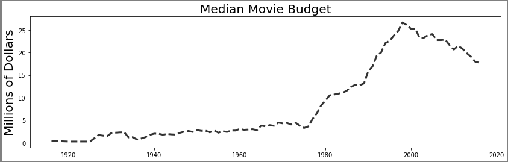
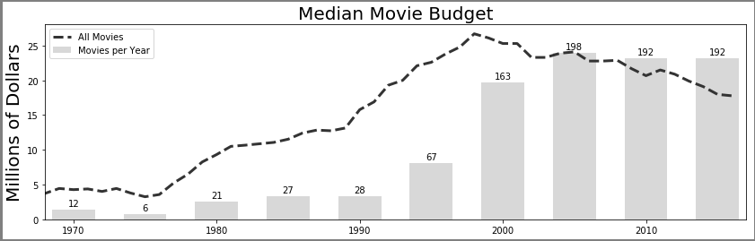
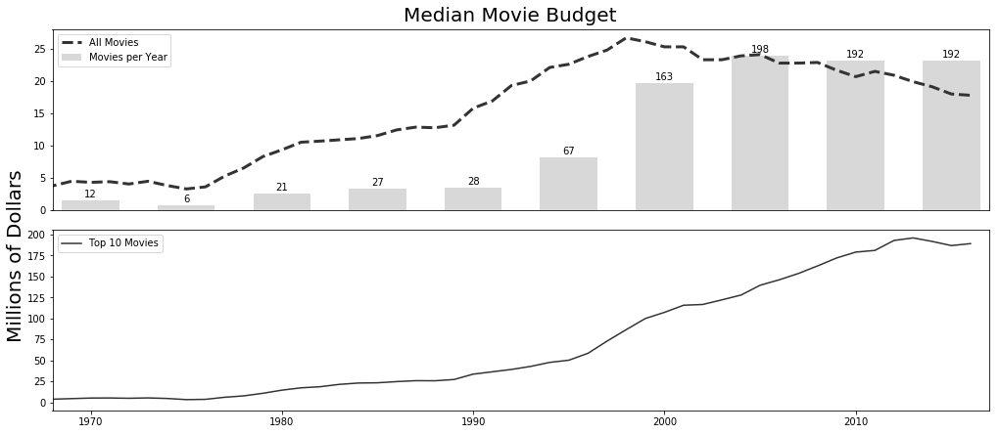
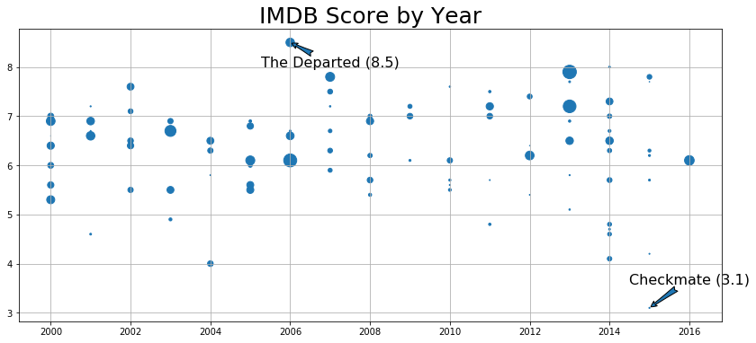

```python
import pandas as pd
import numpy as np
import matplotlib.pyplot as plt

%matplotlib inline
```


```python
movie = pd.read_csv('data/movie.csv')
med_budget = movie.groupby('title_year')['budget'].median() / 1e6
med_budget_roll = med_budget.rolling(5, min_periods=1).mean()
med_budget_roll.tail()
```


    title_year
    2012.0    20.893
    2013.0    19.893
    2014.0    19.100
    2015.0    17.980
    2016.0    17.780
    Name: budget, dtype: float64


```python
years = med_budget_roll.index.values
years[-5:]
```


    array([2012., 2013., 2014., 2015., 2016.])


```python
budget = med_budget_roll.values
budget[-5:]
```


    array([20.893, 19.893, 19.1  , 17.98 , 17.78 ])


```python
fig, ax = plt.subplots(figsize=(14,4), linewidth=5, edgecolor='.5')
ax.plot(years, budget, linestyle='--', linewidth=3, color='.2', label='All Movies')
text_kwargs=dict(fontsize=20, family='cursive')
ax.set_title('Median Movie Budget', **text_kwargs)
ax.set_ylabel('Millions of Dollars', **text_kwargs)
```


    Text(0, 0.5, 'Millions of Dollars')


    /usr/local/lib/python3.6/dist-packages/matplotlib/font_manager.py:1241: UserWarning: findfont: Font family ['cursive'] not found. Falling back to DejaVu Sans.
      (prop.get_family(), self.defaultFamily[fontext]))





```python
movie_count = movie.groupby('title_year')['budget'].count()
movie_count.tail()
```


    title_year
    2012.0    191
    2013.0    208
    2014.0    221
    2015.0    192
    2016.0     86
    Name: budget, dtype: int64


```python
ct = movie_count.values
ct_norm = ct / ct.max() * budget.max()

fifth_year = (years % 5 == 0) & (years >= 1970)
years_5 = years[fifth_year]
ct_5 = ct[fifth_year]
ct_norm_5 = ct_norm[fifth_year]

ax.bar(years_5, ct_norm_5, 3, facecolor='.5', alpha=.3, label='Movies per Year')
ax.set_xlim(1968, 2017)
for x, y, v in zip(years_5, ct_norm_5, ct_5):
    ax.text(x, y + .5, str(v), ha='center')
ax.legend()
fig
```





```python
top10 = movie.sort_values('budget', ascending=False) \
             .groupby('title_year')['budget'] \
             .apply(lambda x: x.iloc[:10].median() / 1e6)
        
top10_roll = top10.rolling(5, min_periods=1).mean()
top10_roll.tail()
```


    title_year
    2012.0    192.9
    2013.0    195.9
    2014.0    191.7
    2015.0    186.8
    2016.0    189.1
    Name: budget, dtype: float64


```python
fig2, ax_array = plt.subplots(2, 1, figsize=(14,6), sharex=True)
ax1 = ax_array[0]
ax2 = ax_array[1]

ax1.plot(years, budget, linestyle='--', linewidth=3, color='.2', label='All Movies')
ax1.bar(years_5, ct_norm_5, 3, facecolor='.5', alpha=.3, label='Movies per Year')
ax1.legend(loc='upper left')
ax1.set_xlim(1968, 2017)
plt.setp(ax1.get_xticklines(), visible=False)

for x, y, v in zip(years_5, ct_norm_5, ct_5):
    ax1.text(x, y + .5, str(v), ha='center')

ax2.plot(years, top10_roll.values, color='.2', label='Top 10 Movies')
ax2.legend(loc='upper left')

fig2.tight_layout()
fig2.suptitle('Median Movie Budget', y=1.02, **text_kwargs)
fig2.text(0, .6, 'Millions of Dollars', rotation='vertical', ha='center', **text_kwargs)

import os
path = os.path.expanduser('~/Desktop/movie_budget.png')
fig2.savefig(path, bbox_inches='tight')
```





```python
med_budget_roll.tail()
```


    title_year
    2012.0    20.893
    2013.0    19.893
    2014.0    19.100
    2015.0    17.980
    2016.0    17.780
    Name: budget, dtype: float64


```python
med_budget.loc[2012:2016].mean()
```


    17.78


```python
med_budget.loc[2011:2015].mean()
```


    17.98


```python
med_budget.loc[2010:2014].mean()
```


    19.1


```python
os.path.expanduser('~/Desktop/movie_budget.png')
```


    '/home/rodesta/Desktop/movie_budget.png'


```python
cols = ['budget', 'title_year', 'imdb_score', 'movie_title']
m = movie[cols].dropna()

# m = movie[['budget', 'title_year', 'imdb_score', 'movie_title']].dropna()
m['budget2'] = m['budget'] / 1e6
np.random.seed(0)
movie_samp = m.query('title_year >= 2000').sample(100)

fig, ax = plt.subplots(figsize=(14,6))
ax.scatter(x='title_year', y='imdb_score', s='budget2', data=movie_samp)

idx_min = movie_samp['imdb_score'].idxmin()
idx_max = movie_samp['imdb_score'].idxmax()
for idx, offset in zip([idx_min, idx_max], [.5, -.5]):
    year = movie_samp.loc[idx, 'title_year']
    score = movie_samp.loc[idx, 'imdb_score']
    title = movie_samp.loc[idx, 'movie_title']
    ax.annotate(xy=(year, score), 
                xytext=(year + 1, score + offset), 
                s=title + ' ({})'.format(score),
                ha='center',
                size=16,
                arrowprops=dict(arrowstyle="fancy"))
ax.set_title('IMDB Score by Year', size=25)
ax.grid(True)
```





```python

```
